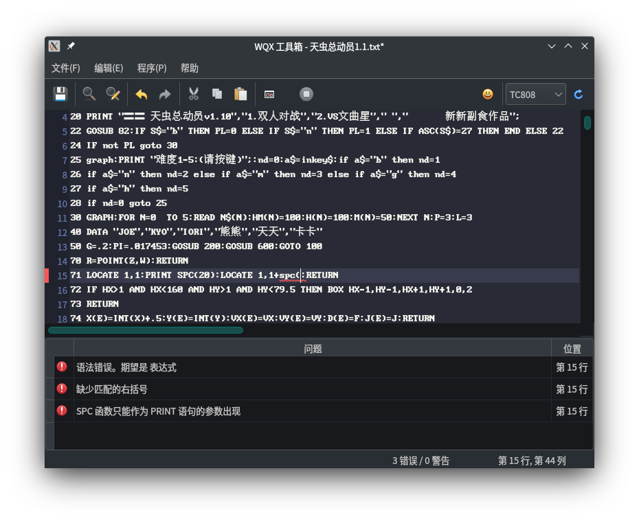
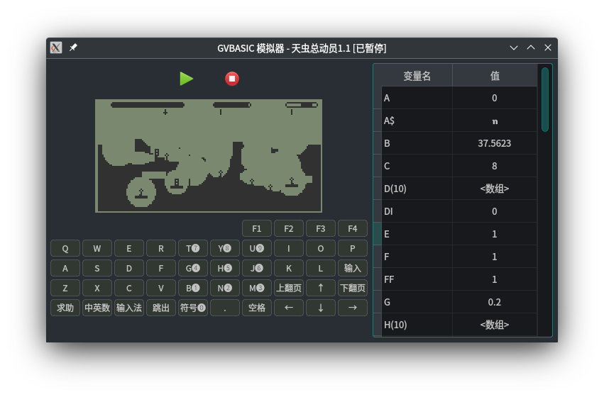

# WQX工具箱

功能：

- [x] GVBASIC编辑器、模拟器：编辑 `.bas`、`.txt` 格式的 GVBASIC 程序，格式转换（`.bas` 转 `.txt`、`.txt` 转 `.bas`），运行 GVBASIC 程序。
- [ ] GVmaker1.0模拟器
- [ ] PAC文件解包
- [ ] EBK阅读器

<details>
  <summary>截图</summary>

  GVBASIC编辑器(Linux)：
  

  GVBASIC模拟器(Linux)：
  

</details>

发版专用仓库：<https://gitlab.com/arucil/wqxtools-release>

## 编译

编译本项目需要的环境：`Rust (nightly)`、`C++ 17及以上`、`Qt 5.15.0 及以上`，以及`Python`（用于编译 `Scintilla`，`Python 2`或`Python 3`皆可）。

clone 项目到本地，然后运行 `git submodule update --init --recursive` 下载 git submodule。

按照 `gui/BUILD_SCINTILLA` 中的指引，编译 `Scintilla` 组件。

安装编译辅助工具：

```shell
cargo install cargo-make cbindgen
```

编译：

```shell
cargo make -p release all
```

测试：
```shell
cargo test --all
```
